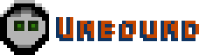
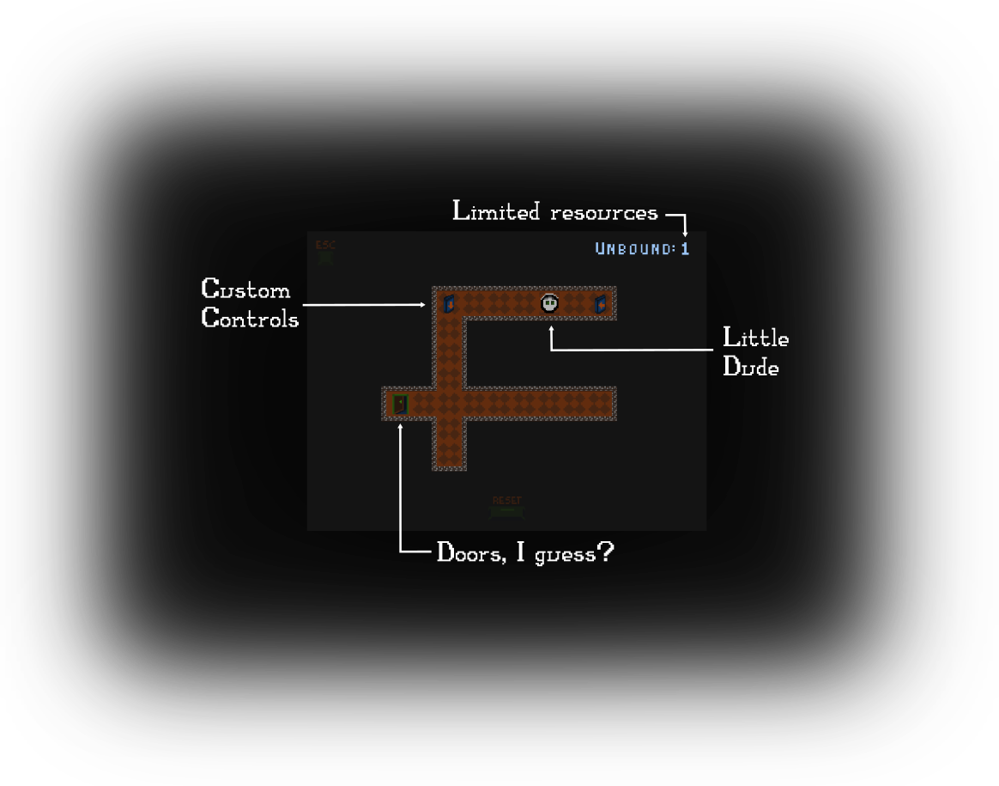
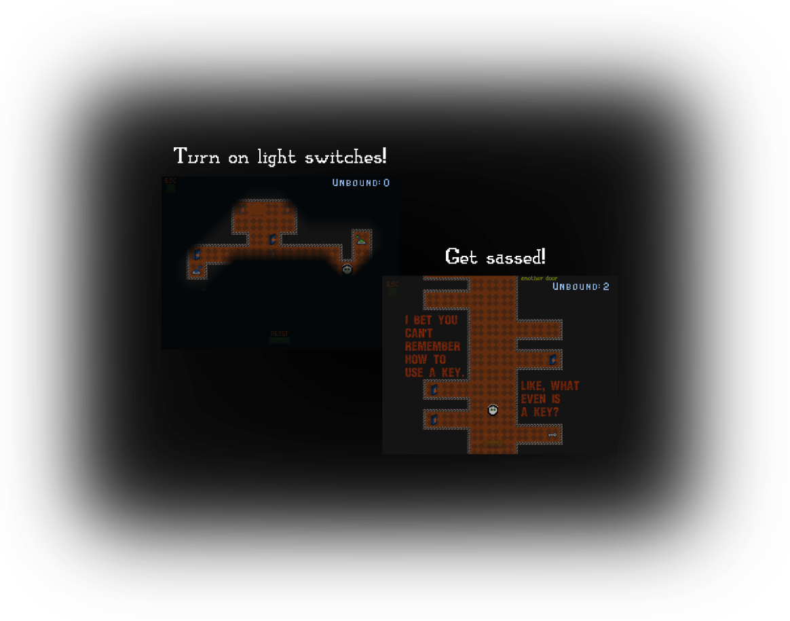
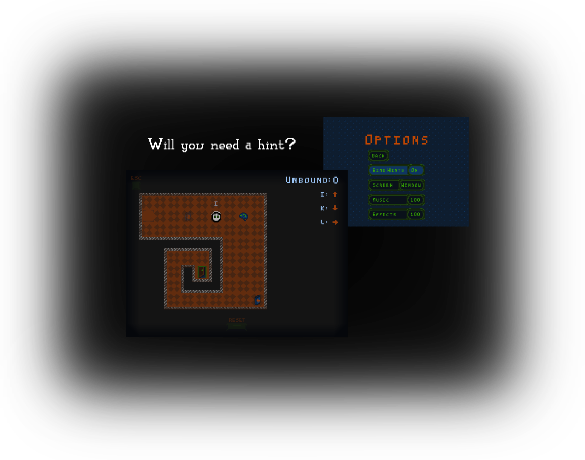

- Download on Itch.io: https://ssangervasi.itch.io/unbound
- Open source on GitHub: https://github.com/ssangervasi/unbound
- Made with GDevelop: https://github.com/4ian/GDevelop

## Make up the controls as you play

Start each level with no keys bound.

Step on "binders" to gain a sense of direction — until you run out of memory. 

## Find your way out 

These disembodied voices are hiding something from you...

The exit. Also their private thoughts and feelings. But mostly the exit. 

## Test your logic and your memory

# Development

Unbound was created by [Sebastian Sangervasi](https://sangervasi.net).

The soundtrack is by [jaVus](https://soundcloud.com/javus).

The game's source code in `Unbound.json`, `refactor`, and `ts-events` are under the MIT license and can be used accordingly.

